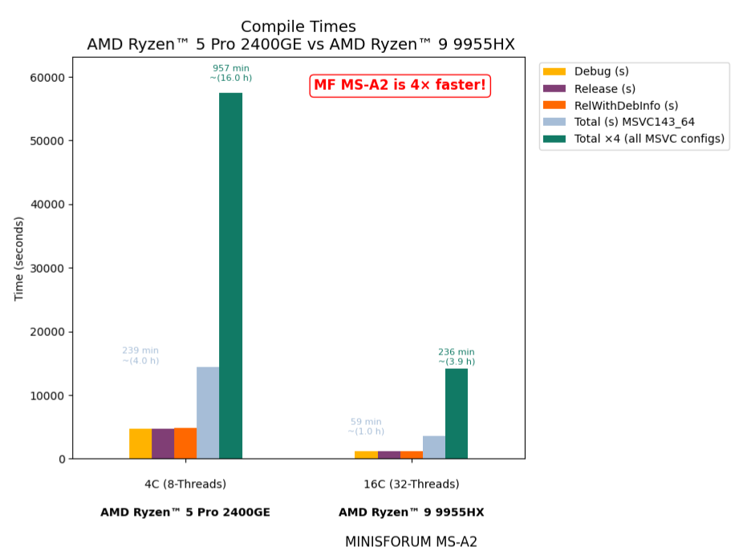

# Prebuilt Binaries for gRPC C++ on Windows

### Overview

Prebuilt binaries for gRPC C++ are available for:

- **Stable build**: [v1.78.1](https://github.com/grpc/grpc/releases/tag/v1.78.1)

Visit the release page to download the binaries ➡️ [here](https://github.com/thommyho/gRPC_windows/releases/v1.78.1) ⬅️.

> **Note**: Starting with v1.78.1, the deployment layout for the CMake files has changed.
> The `cmake` directory has been moved from the project root into the `lib` directory.
> This enables straightforward integration using `find_package` with CMake.

> [!IMPORTANT]
> gRPC C++ **v1.47.0** is the first release requiring C++14.
> If you cannot upgrade to C++14 at this time, you can use gRPC C++ 1.46.x.
> gRPC C++ **v1.46.x** will be maintained by having fixes for
> critical bugs (P0) and security fixes until **2023-06-01**.

- **Last stable build for gRPC requiring only C++11 support**: [v1.46.7](https://github.com/grpc/grpc/releases/tag/v1.46.7)

Visit the release page to download the binaries ➡️ [here](https://github.com/thommyho/gRPC_windows/releases/v1.46.7) ⬅️.

> **Note**: Prebuilt binaries are available as ZIP archives from [Releases](https://github.com/thommyho/gRPC_windows/releases) page.
> For detailed build information (e.g., compilers, SDKs), refer to the Build-Info links (tracking since v1.22.0).

### Additional Visual Studio Examples

Most C++ examples from the [gRPC repository](https://github.com/grpc/grpc/tree/master/examples/cpp) have been ported to a
Visual Studio-compatible structure. These examples are maintained at [Cpp-gRPC-Visual-Studio-Examples](https://github.com/thommyho/Cpp-gRPC-Visual-Studio-Examples)
and are tested with gRPC versions v1.42.0 and above.

### Documentation

➡️ [Step-by-Step Installation Guide](https://thommyho.github.io/Cpp-gRPC-Windows-PreBuilts) ⬅️

______________________________________________________________________

### Releases

| Version                                                                  | Build-Info                                                                   | Build Configurations                        | Compiler Set                                                         | Example |
| ------------------------------------------------------------------------ | ---------------------------------------------------------------------------- | ------------------------------------------- | -------------------------------------------------------------------- | ------- |
| [v1.78.1](https://github.com/thommyho/gRPC_windows/releases/tag/v1.78.1) | [Build Info](https://github.com/thommyho/gRPC_windows_prebuilt/tree/v1.78.1) | 🛠️ Debug 🚀 Release 🔧 RelWithDebInfo | 💻 MSVC143: x86, x64 🖥️ MSVC142: x86, x64                      | ✅      |
| [v1.46.7](https://github.com/thommyho/gRPC_windows/releases/tag/v1.46.7) | [Build Info](https://github.com/thommyho/gRPC_windows_prebuilt/tree/v1.46.7) | 🛠️ Debug 🚀 Release 🔧 RelWithDebInfo | 💻 MSVC143: x86, x64 🖥️ MSVC142: x86, x64 🔲 MSVC141: x86, x64 | ✅      |

> [!TIP]
> For older releases, expand the section below.

View Older Releases

| Version                                                                  | Build-Info                                                                   | Build Configurations                        | Compiler Set                                     | Example |
| ------------------------------------------------------------------------ | ---------------------------------------------------------------------------- | ------------------------------------------- | ------------------------------------------------ | ------- |
| [v1.78.1](https://github.com/thommyho/gRPC_windows/releases/tag/v1.78.1) | [Build Info](https://github.com/thommyho/gRPC_windows_prebuilt/tree/v1.78.1) | 🛠️ Debug 🚀 Release 🔧 RelWithDebInfo | 💻 MSVC143: x86, x64 🖥️ MSVC142: x86, x64  | ✅      |
| [v1.78.0](https://github.com/thommyho/gRPC_windows/releases/tag/v1.78.0) | [Build Info](https://github.com/thommyho/gRPC_windows_prebuilt/tree/v1.78.0) | 🛠️ Debug 🚀 Release 🔧 RelWithDebInfo | 💻 MSVC143: x86, x64 🖥️ MSVC142: x86, x64  | ✅      |
| [v1.76.0](https://github.com/thommyho/gRPC_windows/releases/tag/v1.76.0) | [Build Info](https://github.com/thommyho/gRPC_windows_prebuilt/tree/v1.76.0) | 🛠️ Debug 🚀 Release 🔧 RelWithDebInfo | 💻 MSVC143: x86, x64 🖥️ MSVC142: x86, x64  | ✅      |
| [v1.75.1](https://github.com/thommyho/gRPC_windows/releases/tag/v1.75.1) | [Build Info](https://github.com/thommyho/gRPC_windows_prebuilt/tree/v1.75.1) | 🛠️ Debug 🚀 Release 🔧 RelWithDebInfo | 💻 MSVC143: x86, x64 🖥️ MSVC142: x86, x64  | ✅      |
| [v1.75.0](https://github.com/thommyho/gRPC_windows/releases/tag/v1.75.0) | [Build Info](https://github.com/thommyho/gRPC_windows_prebuilt/tree/v1.75.0) | 🛠️ Debug 🚀 Release 🔧 RelWithDebInfo | 💻 MSVC143: x86, x64 🖥️ MSVC142: x86, x64  | ✅      |
| [v1.74.1](https://github.com/thommyho/gRPC_windows/releases/tag/v1.74.1) | [Build Info](https://github.com/thommyho/gRPC_windows_prebuilt/tree/v1.74.1) | 🛠️ Debug 🚀 Release 🔧 RelWithDebInfo | 💻 MSVC143: x86, x64 🖥️ MSVC142: x86, x64  | ✅      |
| [v1.74.0](https://github.com/thommyho/gRPC_windows/releases/tag/v1.74.0) | [Build Info](https://github.com/thommyho/gRPC_windows_prebuilt/tree/v1.74.0) | 🛠️ Debug 🚀 Release 🔧 RelWithDebInfo | 💻 MSVC143: x86, x64 🖥️ MSVC142: x86, x64  | ✅      |
| [v1.73.1](https://github.com/thommyho/gRPC_windows/releases/tag/v1.73.1) | [Build Info](https://github.com/thommyho/gRPC_windows_prebuilt/tree/v1.73.1) | 🛠️ Debug 🚀 Release 🔧 RelWithDebInfo | 💻 MSVC143: x86, x64 🖥️ MSVC142: x86, x64  | ✅      |
| [v1.73.0](https://github.com/thommyho/gRPC_windows/releases/tag/v1.73.0) | [Build Info](https://github.com/thommyho/gRPC_windows_prebuilt/tree/v1.73.0) | 🛠️ Debug 🚀 Release 🔧 RelWithDebInfo | 💻 MSVC143: x86, x64 🖥️ MSVC142: x86, x64  | ✅      |
| [v1.72.1](https://github.com/thommyho/gRPC_windows/releases/tag/v1.72.1) | [Build Info](https://github.com/thommyho/gRPC_windows_prebuilt/tree/v1.72.1) | 🛠️ Debug 🚀 Release 🔧 RelWithDebInfo | 💻 MSVC143: x86, x64 🖥️ MSVC142: x86, x64  | ✅      |
| [v1.72.0](https://github.com/thommyho/gRPC_windows/releases/tag/v1.72.0) | [Build Info](https://github.com/thommyho/gRPC_windows_prebuilt/tree/v1.72.0) | 🛠️ Debug 🚀 Release 🔧 RelWithDebInfo | 💻 MSVC143: x86, x64 🖥️ MSVC142: x86, x64  | ✅      |
| [v1.71.0](https://github.com/thommyho/gRPC_windows/releases/tag/v1.71.0) | [Build Info](https://github.com/thommyho/gRPC_windows_prebuilt/tree/v1.71.0) | 🛠️ Debug 🚀 Release 🔧 RelWithDebInfo | 💻 MSVC143: x86, x64 🖥️ MSVC142: x86, x64  | ✅      |
| [v1.70.2](https://github.com/thommyho/gRPC_windows/releases/tag/v1.70.2) | [Build Info](https://github.com/thommyho/gRPC_windows_prebuilt/tree/v1.70.2) | 🛠️ Debug 🚀 Release 🔧 RelWithDebInfo | 💻 MSVC143: x86, x64 🖥️ MSVC142: x86, x64  | ✅      |
| [v1.70.1](https://github.com/thommyho/gRPC_windows/releases/tag/v1.70.1) | [Build Info](https://github.com/thommyho/gRPC_windows_prebuilt/tree/v1.70.1) | 🛠️ Debug 🚀 Release 🔧 RelWithDebInfo | 💻 MSVC143: x86, x64 🖥️ MSVC142: x86, x64  | ✅      |
| [v1.70.0](https://github.com/thommyho/gRPC_windows/releases/tag/v1.70.0) | [Build Info](https://github.com/thommyho/gRPC_windows_prebuilt/tree/v1.70.0) | 🛠️ Debug 🚀 Release 🔧 RelWithDebInfo | 💻 MSVC143: x86, x64 🖥️ MSVC142: x86, x64  | ✅      |
| [v1.69.0](https://github.com/thommyho/gRPC_windows/releases/tag/v1.69.0) | [Build Info](https://github.com/thommyho/gRPC_windows_prebuilt/tree/v1.69.0) | 🛠️ Debug 🚀 Release 🔧 RelWithDebInfo | 💻 MSVC143: x86, x64 🖥️ MSVC142: x86, x64  | ✅      |
| [v1.68.2](https://github.com/thommyho/gRPC_windows/releases/tag/v1.68.2) | [Build Info](https://github.com/thommyho/gRPC_windows_prebuilt/tree/v1.68.2) | 🛠️ Debug 🚀 Release 🔧 RelWithDebInfo | 💻 MSVC143: x86, x64 🖥️ MSVC142: x86, x64  | ✅      |
| [v1.68.1](https://github.com/thommyho/gRPC_windows/releases/tag/v1.68.1) | [Build Info](https://github.com/thommyho/gRPC_windows_prebuilt/tree/v1.68.1) | 🛠️ Debug 🚀 Release 🔧 RelWithDebInfo | 💻 MSVC143: x86, x64 🖥️ MSVC142: x86, x64  | ✅      |
| [v1.68.0](https://github.com/thommyho/gRPC_windows/releases/tag/v1.68.0) | [Build Info](https://github.com/thommyho/gRPC_windows_prebuilt/tree/v1.68.0) | 🛠️ Debug 🚀 Release 🔧 RelWithDebInfo | 💻 MSVC143: x86, x64 🖥️ MSVC142: x86, x64  | ✅      |
| [v1.67.1](https://github.com/thommyho/gRPC_windows/releases/tag/v1.67.1) | [Build Info](https://github.com/thommyho/gRPC_windows_prebuilt/tree/v1.67.1) | 🛠️ Debug 🚀 Release 🔧 RelWithDebInfo | 💻 MSVC143: x86, x64 🖥️ MSVC142: x86, x64  | ✅      |
| [v1.67.0](https://github.com/thommyho/gRPC_windows/releases/tag/v1.67.0) | [Build Info](https://github.com/thommyho/gRPC_windows_prebuilt/tree/v1.67.0) | 🛠️ Debug 🚀 Release 🔧 RelWithDebInfo | 💻 MSVC143: x86, x64 🖥️ MSVC142: x86, x64  | ✅      |
| [v1.66.2](https://github.com/thommyho/gRPC_windows/releases/tag/v1.66.2) | [Build Info](https://github.com/thommyho/gRPC_windows_prebuilt/tree/v1.66.2) | 🛠️ Debug 🚀 Release 🔧 RelWithDebInfo | 💻 MSVC143: x86, x64 🖥️ MSVC142: x86, x64  | ✅      |
| [v1.66.1](https://github.com/thommyho/gRPC_windows/releases/tag/v1.66.1) | [Build Info](https://github.com/thommyho/gRPC_windows_prebuilt/tree/v1.66.1) | 🛠️ Debug 🚀 Release 🔧 RelWithDebInfo | 💻 MSVC143: x86, x64 🖥️ MSVC142: x86, x64  | ✅      |
| [v1.65.0](https://github.com/thommyho/gRPC_windows/releases/tag/v1.65.0) | [Build Info](https://github.com/thommyho/gRPC_windows_prebuilt/tree/v1.65.0) | 🛠️ Debug 🚀 Release 🔧 RelWithDebInfo | 💻 MSVC143: x86, x64 🖥️ MSVC142: x86, x64  | ✅      |
| [v1.64.2](https://github.com/thommyho/gRPC_windows/releases/tag/v1.64.2) | [Build Info](https://github.com/thommyho/gRPC_windows_prebuilt/tree/v1.64.2) | 🛠️ Debug 🚀 Release 🔧 RelWithDebInfo | 💻 MSVC143: x86, x64 🖥️ MSVC142: x86, x64  | ✅      |
| [v1.64.1](https://github.com/thommyho/gRPC_windows/releases/tag/v1.64.1) | [Build Info](https://github.com/thommyho/gRPC_windows_prebuilt/tree/v1.64.1) | 🛠️ Debug 🚀 Release 🔧 RelWithDebInfo | 💻 MSVC143: x86, x64 🖥️ MSVC142: x86, x64  | ✅      |
| [v1.64.0](https://github.com/thommyho/gRPC_windows/releases/tag/v1.64.0) | [Build Info](https://github.com/thommyho/gRPC_windows_prebuilt/tree/v1.64.0) | 🛠️ Debug 🚀 Release 🔧 RelWithDebInfo | 💻 MSVC143: x86, x64 🖥️ MSVC142: x86, x64  | ✅      |
| [v1.63.0](https://github.com/thommyho/gRPC_windows/releases/tag/v1.63.0) | [Build Info](https://github.com/thommyho/gRPC_windows_prebuilt/tree/v1.63.0) | 🛠️ Debug 🚀 Release 🔧 RelWithDebInfo | 💻 MSVC143: x86, x64 🖥️ MSVC142: x86, x64  | ✅      |
| [v1.62.1](https://github.com/thommyho/gRPC_windows/releases/tag/v1.62.1) | [Build Info](https://github.com/thommyho/gRPC_windows_prebuilt/tree/v1.62.1) | 🛠️ Debug 🚀 Release 🔧 RelWithDebInfo | 💻 MSVC143: x86, x64 🖥️ MSVC142: x86, x64  | ✅      |
| [v1.62.0](https://github.com/thommyho/gRPC_windows/releases/tag/v1.62.0) | [Build Info](https://github.com/thommyho/gRPC_windows_prebuilt/tree/v1.62.0) | 🛠️ Debug 🚀 Release 🔧 RelWithDebInfo | 💻 MSVC143: x86, x64 🖥️ MSVC142: x86, x64  | ✅      |
| [v1.61.1](https://github.com/thommyho/gRPC_windows/releases/tag/v1.61.1) | [Build Info](https://github.com/thommyho/gRPC_windows_prebuilt/tree/v1.61.1) | 🛠️ Debug 🚀 Release 🔧 RelWithDebInfo | 💻 MSVC143: x86, x64 🖥️ MSVC142: x86, x64  | ✅      |
| [v1.60.0](https://github.com/thommyho/gRPC_windows/releases/tag/v1.60.0) | [Build Info](https://github.com/thommyho/gRPC_windows_prebuilt/tree/v1.60.0) | 🛠️ Debug 🚀 Release 🔧 RelWithDebInfo | 💻 MSVC143: x86, x64 🖥️ MSVC142: x86, x64  | ✅      |
| [v1.61.0](https://github.com/thommyho/gRPC_windows/releases/tag/v1.61.0) | [Build Info](https://github.com/thommyho/gRPC_windows_prebuilt/tree/v1.61.0) | 🛠️ Debug 🚀 Release 🔧 RelWithDebInfo | 💻 MSVC143: x86, x64 🖥️ MSVC142: x86, x64  | ✅      |
| [v1.59.1](https://github.com/thommyho/gRPC_windows/releases/tag/v1.59.1) | [Build Info](https://github.com/thommyho/gRPC_windows_prebuilt/tree/v1.59.1) | 🛠️ Debug 🚀 Release 🔧 RelWithDebInfo | 💻 MSVC143: x86, x64 🖥️ MSVC142: x86, x64  | ✅      |
| [v1.58.0](https://github.com/thommyho/gRPC_windows/releases/tag/v1.58.0) | [Build Info](https://github.com/thommyho/gRPC_windows_prebuilt/tree/v1.58.0) | 🛠️ Debug 🚀 Release 🔧 RelWithDebInfo | 💻 MSVC143: x86, x64 🖥️ MSVC142: x86, x64  | ✅      |
| [v1.57.0](https://github.com/thommyho/gRPC_windows/releases/tag/v1.57.0) | [Build Info](https://github.com/thommyho/gRPC_windows_prebuilt/tree/v1.57.0) | 🛠️ Debug 🚀 Release 🔧 RelWithDebInfo | 💻 MSVC143: x86, x64 🖥️ MSVC142: x86, x64  | ✅      |
| [v1.56.2](https://github.com/thommyho/gRPC_windows/releases/tag/v1.56.2) | [Build Info](https://github.com/thommyho/gRPC_windows_prebuilt/tree/v1.56.2) | 🛠️ Debug 🚀 Release 🔧 RelWithDebInfo | 💻 MSVC143: x86, x64 🖥️ MSVC142: x86, x64  | ✅      |
| [v1.56.0](https://github.com/thommyho/gRPC_windows/releases/tag/v1.56.0) | [Build Info](https://github.com/thommyho/gRPC_windows_prebuilt/tree/v1.56.0) | 🛠️ Debug 🚀 Release 🔧 RelWithDebInfo | 💻 MSVC143: x86, x64 🖥️ MSVC142: x86, x64  | ✅      |
| [v1.55.1](https://github.com/thommyho/gRPC_windows/releases/tag/v1.55.1) | [Build Info](https://github.com/thommyho/gRPC_windows_prebuilt/tree/v1.55.1) | 🛠️ Debug 🚀 Release 🔧 RelWithDebInfo | 💻 MSVC143: x86, x64 🖥️ MSVC142: x86, x64  | ✅      |
| [v1.55.0](https://github.com/thommyho/gRPC_windows/releases/tag/v1.55.0) | [Build Info](https://github.com/thommyho/gRPC_windows_prebuilt/tree/v1.55.0) | 🛠️ Debug 🚀 Release 🔧 RelWithDebInfo | 💻 MSVC143: x86, x64 🖥️ MSVC142: x86, x64  | ✅      |
| [v1.54.2](https://github.com/thommyho/gRPC_windows/releases/tag/v1.54.2) | [Build Info](https://github.com/thommyho/gRPC_windows_prebuilt/tree/v1.54.2) | 🛠️ Debug 🚀 Release 🔧 RelWithDebInfo | 💻 MSVC143: x86, x64 🖥️ MSVC142: x86, x64  | ✅      |
| [v1.54.1](https://github.com/thommyho/gRPC_windows/releases/tag/v1.54.1) | [Build Info](https://github.com/thommyho/gRPC_windows_prebuilt/tree/v1.54.1) | 🛠️ Debug 🚀 Release 🔧 RelWithDebInfo | 💻 MSVC143: x86, x64 🖥️ MSVC142: x86, x64  | ✅      |
| [v1.54.0](https://github.com/thommyho/gRPC_windows/releases/tag/v1.54.0) | [Build Info](https://github.com/thommyho/gRPC_windows_prebuilt/tree/v1.54.0) | 🛠️ Debug 🚀 Release 🔧 RelWithDebInfo | 💻 MSVC143: x86, x64 🖥️ MSVC142: x86, x64  | ✅      |
| [v1.53.0](https://github.com/thommyho/gRPC_windows/releases/tag/v1.53.0) | [Build Info](https://github.com/thommyho/gRPC_windows_prebuilt/tree/v1.53.0) | 🛠️ Debug 🚀 Release 🔧 RelWithDebInfo | 💻 MSVC143: x86, x64 🖥️ MSVC142: x86, x64  | ✅      |
| [v1.52.1](https://github.com/thommyho/gRPC_windows/releases/tag/v1.52.1) | [Build Info](https://github.com/thommyho/gRPC_windows_prebuilt/tree/v1.52.1) | 🛠️ Debug 🚀 Release 🔧 RelWithDebInfo | 💻 MSVC143: x86, x64 🖥️ MSVC142: x86, x64  | ✅      |
| [v1.52.0](https://github.com/thommyho/gRPC_windows/releases/tag/v1.52.0) | [Build Info](https://github.com/thommyho/gRPC_windows_prebuilt/tree/v1.52.0) | 🛠️ Debug 🚀 Release 🔧 RelWithDebInfo | 💻 MSVC143: x86, x64 🖥️ MSVC142: x86, x64  | ✅      |
| [v1.51.1](https://github.com/thommyho/gRPC_windows/releases/tag/v1.51.1) | [Build Info](https://github.com/thommyho/gRPC_windows_prebuilt/tree/v1.51.1) | 🛠️ Debug 🚀 Release 🔧 RelWithDebInfo | 💻 MSVC143: x86, x64 🖥️ MSVC142: x86, x64  | ✅      |
| [v1.51.0](https://github.com/thommyho/gRPC_windows/releases/tag/v1.51.0) | [Build Info](https://github.com/thommyho/gRPC_windows_prebuilt/tree/v1.51.0) | 🛠️ Debug 🚀 Release 🔧 RelWithDebInfo | 💻 MSVC143: x86, x64 🖥️ MSVC142: x86, x64  | ✅      |
| [v1.50.1](https://github.com/thommyho/gRPC_windows/releases/tag/v1.50.1) | [Build Info](https://github.com/thommyho/gRPC_windows_prebuilt/tree/v1.50.1) | 🛠️ Debug 🚀 Release 🔧 RelWithDebInfo | 💻 MSVC143: x86, x64 🖥️ MSVC142: x86, x64  | ✅      |
| [v1.50.0](https://github.com/thommyho/gRPC_windows/releases/tag/v1.50.0) | [Build Info](https://github.com/thommyho/gRPC_windows_prebuilt/tree/v1.50.0) | 🛠️ Debug 🚀 Release 🔧 RelWithDebInfo | 💻 MSVC143: x86, x64 🖥️ MSVC142: x86, x64  | ✅      |
| [v1.49.1](https://github.com/thommyho/gRPC_windows/releases/tag/v1.49.1) | [Build Info](https://github.com/thommyho/gRPC_windows_prebuilt/tree/v1.49.1) | 🛠️ Debug 🚀 Release 🔧 RelWithDebInfo | 💻 MSVC143: x86, x64 🖥️ MSVC142: x86, x64  | ✅      |
| [v1.48.0](https://github.com/thommyho/gRPC_windows/releases/tag/v1.48.0) | [Build Info](https://github.com/thommyho/gRPC_windows_prebuilt/tree/v1.48.0) | 🛠️ Debug 🚀 Release 🔧 RelWithDebInfo | 💻 MSVC143: x86, x64 🖥️ MSVC142: x86, x64  | ✅      |
| [v1.46.6](https://github.com/thommyho/gRPC_windows/releases/tag/v1.46.6) | [Build Info](https://github.com/thommyho/gRPC_windows_prebuilt/tree/v1.46.6) | 🛠️ Debug 🚀 Release 🔧 RelWithDebInfo | 💻 MSVC143: x86, x64 🖥️ MSVC142: x86, x64  | ✅      |
| [v1.46.5](https://github.com/thommyho/gRPC_windows/releases/tag/v1.46.5) | [Build Info](https://github.com/thommyho/gRPC_windows_prebuilt/tree/v1.46.5) | 🛠️ Debug 🚀 Release 🔧 RelWithDebInfo | 💻 MSVC143: x86, x64 🖥️ MSVC142: x86, x64  | ✅      |
| [v1.46.4](https://github.com/thommyho/gRPC_windows/releases/tag/v1.46.4) | [Build Info](https://github.com/thommyho/gRPC_windows_prebuilt/tree/v1.46.4) | 🛠️ Debug 🚀 Release 🔧 RelWithDebInfo | 💻 MSVC143: x86, x64 🖥️ MSVC142: x86, x64  | ✅      |
| [v1.46.3](https://github.com/thommyho/gRPC_windows/releases/tag/v1.46.3) | [Build Info](https://github.com/thommyho/gRPC_windows_prebuilt/tree/v1.46.3) | 🛠️ Debug 🚀 Release 🔧 RelWithDebInfo | 💻 MSVC143: x86, x64 🖥️ MSVC142: x86, x64  | ✅      |
| [v1.46.1](https://github.com/thommyho/gRPC_windows/releases/tag/v1.46.1) | [Build Info](https://github.com/thommyho/gRPC_windows_prebuilt/tree/v1.46.1) | 🛠️ Debug 🚀 Release 🔧 RelWithDebInfo | 💻 MSVC143: x86, x64 🖥️ MSVC142: x86, x64  | ✅      |
| [v1.45.2](https://github.com/thommyho/gRPC_windows/releases/tag/v1.45.2) | [Build Info](https://github.com/thommyho/gRPC_windows_prebuilt/tree/v1.45.2) | 🛠️ Debug 🚀 Release 🔧 RelWithDebInfo | 💻 MSVC143: x86, x64 🖥️ MSVC142: x86, x64  | ✅      |
| [v1.45.1](https://github.com/thommyho/gRPC_windows/releases/tag/v1.45.1) | [Build Info](https://github.com/thommyho/gRPC_windows_prebuilt/tree/v1.45.1) | 🛠️ Debug 🚀 Release 🔧 RelWithDebInfo | 🖥️ MSVC142: x86, x64 🔲 MSVC141: x86, x64     | ✅      |
| [v1.45.0](https://github.com/thommyho/gRPC_windows/releases/tag/v1.45.0) | [Build Info](https://github.com/thommyho/gRPC_windows_prebuilt/tree/v1.45.0) | 🛠️ Debug 🚀 Release 🔧 RelWithDebInfo | 🖥️ MSVC142: x86, x64 🔲 MSVC141: x86, x64     | ✅      |
| [v1.44.0](https://github.com/thommyho/gRPC_windows/releases/tag/v1.44.0) | [Build Info](https://github.com/thommyho/gRPC_windows_prebuilt/tree/v1.44.0) | 🛠️ Debug 🚀 Release 🔧 RelWithDebInfo | 🖥️ MSVC142: x86, x64 🔲 MSVC141: x86, x64     | ✅      |
| [v1.43.2](https://github.com/thommyho/gRPC_windows/releases/tag/v1.43.2) | [Build Info](https://github.com/thommyho/gRPC_windows_prebuilt/tree/v1.43.2) | 🛠️ Debug 🚀 Release 🔧 RelWithDebInfo | 🖥️ MSVC142: x86, x64 🔲 MSVC141: x86, x64     | ✅      |
| [v1.43.0](https://github.com/thommyho/gRPC_windows/releases/tag/v1.43.0) | [Build Info](https://github.com/thommyho/gRPC_windows_prebuilt/tree/v1.43.0) | 🛠️ Debug 🚀 Release 🔧 RelWithDebInfo | 🖥️ MSVC142: x86, x64 🔲 MSVC141: x86, x64     | ✅      |
| [v1.42.0](https://github.com/thommyho/gRPC_windows/releases/tag/v1.42.0) | [Build Info](https://github.com/thommyho/gRPC_windows_prebuilt/tree/v1.42.0) | 🛠️ Debug 🚀 Release 🔧 RelWithDebInfo | 🖥️ MSVC142: x86, x64 🔲 MSVC141: x86, x64     | ✅      |
| [v1.41.1](https://github.com/thommyho/gRPC_windows/releases/tag/v1.41.1) | [Build Info](https://github.com/thommyho/gRPC_windows_prebuilt/tree/v1.41.1) | 🛠️ Debug 🚀 Release 🔧 RelWithDebInfo | 🖥️ MSVC142: x86, x64 🔲 MSVC141: x86, x64     | ✅      |
| [v1.41.0](https://github.com/thommyho/gRPC_windows/releases/tag/v1.41.0) | [Build Info](https://github.com/thommyho/gRPC_windows_prebuilt/tree/v1.41.0) | 🛠️ Debug 🚀 Release 🔧 RelWithDebInfo | 🖥️ MSVC142: x86, x64 🔲 MSVC141: x86, x64     | ✅      |
| [v1.40.0](https://github.com/thommyho/gRPC_windows/releases/tag/v1.40.0) | [Build Info](https://github.com/thommyho/gRPC_windows_prebuilt/tree/v1.40.0) | 🛠️ Debug 🚀 Release 🔧 RelWithDebInfo | 🖥️ MSVC142: x86, x64 🔲 MSVC141: x86, x64     | ✅      |
| [v1.39.1](https://github.com/thommyho/gRPC_windows/releases/tag/v1.39.1) | [Build Info](https://github.com/thommyho/gRPC_windows_prebuilt/tree/v1.39.1) | 🛠️ Debug 🚀 Release 🔧 RelWithDebInfo | 🖥️ MSVC142: x86, x64 🔲 MSVC141: x86, x64     | ✅      |
| [v1.22.0](https://github.com/thommyho/gRPC_windows/releases/tag/v1.22.0) | [Build Info](https://github.com/thommyho/gRPC_windows_prebuilt/tree/v1.22.0) | 🛠️ Debug 🚀 Release 🔧 RelWithDebInfo | 🖥️ MSVC142: x86, x64 🔲 MSVC141: x86, x64     | ✅      |
| [v1.21.4](https://github.com/thommyho/gRPC_windows/releases/tag/v1.21.4) | [Build Info](https://github.com/thommyho/gRPC_windows_prebuilt/tree/v1.21.4) | 🛠️ Debug 🚀 Release 🔧 RelWithDebInfo | 🖥️ MSVC142: x86, x64 🔲 MSVC141: x86, x64     | ✅      |
| [v1.20.0](https://github.com/thommyho/gRPC_windows/releases/tag/v1.20.0) | [Build Info](https://github.com/thommyho/gRPC_windows_prebuilt/tree/v1.20.0) | 🛠️ Debug 🚀 Release 🔧 RelWithDebInfo | 🖥️ MSVC142: x86, x64 🔲 MSVC141: x86, x64     | ✅      |

______________________________________________________________________

### Explanation of Symbols

- **Build Configurations**:
  - 🛠️ Debug: Development configuration with debugging symbols.
  - 🚀 Release: Optimized for production use.
  - 🔧 RelWithDebInfo: Combination of optimizations and debugging symbols.
- **Compiler Sets**:
  - 💻 MSVC143: Visual Studio 2022 (x86/x64).
  - 🖥️ MSVC142: Visual Studio 2019 (x86/x64).
  - 🔲 MSVC141: Visual Studio 2017 (x86/x64) --> Discontinued from v1.45.2.

______________________________________________________________________

### Feedback

For suggestions or issues, feel free to open a ticket in the respective repositories:

- Prebuilt binaries: [gRPC Windows](https://github.com/thommyho/gRPC_windows).
- Visual Studio Examples: [Cpp-gRPC-Visual-Studio-Examples](https://github.com/thommyho/Cpp-gRPC-Visual-Studio-Examples).

Thank you for using gRPC for C++ on Windows!

______________________________________________________________________

### Sponsorship

This project is proudly supported by Minisforum, who generously provided the **MS-A2 workstation** - the powerhouse behind our CI/CD pipeline.
Powered by the **AMD Ryzen™ 9 9955HX (16C/32T)**, the MS-A2 has completely transformed my build infrastructure and release velocity.

🔗 Check it out: [https://www.minisforum.com/products/minisforum-ms-a2](https://www.minisforum.com/products/minisforum-ms-a2)

______________________________________________________________________

#### ⚡ Real-World Build Performance Gains

Upgrading from our previous CI machine (Ryzen™ 5 2400GE) to the MS-A2 delivered massive performance improvements across all configurations:

  

| System                        | Debug      | Release    | RelWithDebInfo | Total (3 configs) | Total ×4 platforms |
| ----------------------------- | ---------- | ---------- | -------------- | ----------------- | ------------------ |
| Ryzen™ 5 2400GE (4C/8T)       | 1.30 h     | 1.33 h     | 1.36 h         | 3.99 h            | 15.95 h            |
| **Ryzen™ 9 9955HX (16C/32T)** | **0.33 h** | **0.32 h** | **0.33 h**     | **0.98 h**        | **3.94 h**         |

#### 📉 What That Means

- **🔥 75% reduction** in compile time per configuration
- **⏱ Full CI runs reduced from ~17 hours → ~4.3 hours**
- **🚀 4× faster complete multi-platform builds**
- Faster iteration cycles
- More frequent releases
- Quicker contributor feedback

For a C++ project building across multiple **Visual Studio toolsets (MSVC141, MSVC142, MSVC143)** and architectures (x86, x64), parallelism matters — and 16 cores / 32 threads make a *huge* difference.

______________________________________________________________________

#### 🛠 Why This Matters

Faster CI means:

- Pull requests get validated sooner
- Bugs are caught earlier
- Releases ship faster
- The Windows C++ community gets updated prebuilt binaries more quickly

The MS-A2 enables us to build complex C++ stacks like gRPC efficiently across multiple compiler targets - something that previously required nearly a full day of CI (waiting) time.

______________________________________________________________________

#### ❤️ Thank You

A huge thank you to **Minisforum** for supporting open-source development and helping us improve reliability and delivery speed for our users.

If you're looking for a compact yet extremely capable build workstation, the MS-A2 is absolutely worth checking out.

👉 [https://www.minisforum.com/products/minisforum-ms-a2](https://www.minisforum.com/products/minisforum-ms-a2)
