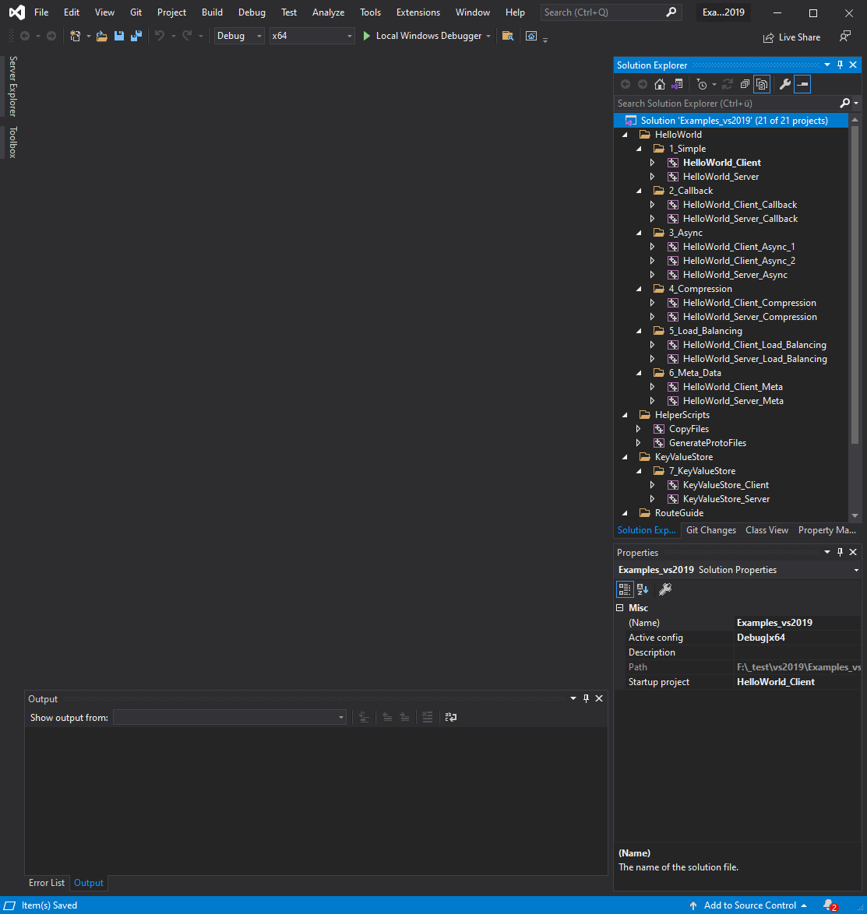
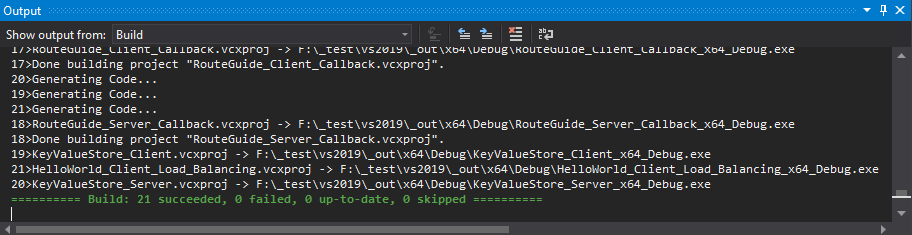

# Getting started

## Download

- Navigate to the [repository](https://github.com/thommyho/Cpp-gRPC-Windows-PreBuilts)
- On the landing page select your desired gRPC version

Or use following release table

|                                                         Version                                                         |                                 Build-Info                                 |        All Build-Configurations         |                Examples                 |
|:-----------------------------------------------------------------------------------------------------------------------:|:--------------------------------------------------------------------------:|:---------------------------------------:|:---------------------------------------:|
| **[1.54.0](https://github.com/thommyho/gRPC_windows/releases/tag/v1.54.0) (:octicons-heart-fill-24:{ .heart } latest)** | **[link](https://github.com/thommyho/gRPC_windows_prebuilt/tree/v1.54.0)** | :material-check-decagram:{ .tick-blue } | :material-check-decagram:{ .tick-blue } |
| **[1.46.6](https://github.com/thommyho/gRPC_windows/releases/tag/v1.46.6) (:octicons-heart-fill-24:{ .heart } latest)** | **[link](https://github.com/thommyho/gRPC_windows_prebuilt/tree/v1.46.6)** | :material-check-decagram:{ .tick-blue } | :material-check-decagram:{ .tick-blue } |
|                         [1.53.0](https://github.com/thommyho/gRPC_windows/releases/tag/v1.53.0)                         |   [link](https://github.com/thommyho/gRPC_windows_prebuilt/tree/v1.53.0)   | :material-check-decagram:{ .tick-blue } | :material-check-decagram:{ .tick-blue } |
|                         [1.52.1](https://github.com/thommyho/gRPC_windows/releases/tag/v1.52.1)                         |   [link](https://github.com/thommyho/gRPC_windows_prebuilt/tree/v1.52.1)   | :material-check-decagram:{ .tick-blue } | :material-check-decagram:{ .tick-blue } |
|                         [1.52.0](https://github.com/thommyho/gRPC_windows/releases/tag/v1.52.0)                         |   [link](https://github.com/thommyho/gRPC_windows_prebuilt/tree/v1.52.0)   | :material-check-decagram:{ .tick-blue } | :material-check-decagram:{ .tick-blue } |
|                         [1.51.1](https://github.com/thommyho/gRPC_windows/releases/tag/v1.51.1)                         |   [link](https://github.com/thommyho/gRPC_windows_prebuilt/tree/v1.51.1)   | :material-check-decagram:{ .tick-blue } | :material-check-decagram:{ .tick-blue } |
|                         [1.51.0](https://github.com/thommyho/gRPC_windows/releases/tag/v1.51.0)                         |   [link](https://github.com/thommyho/gRPC_windows_prebuilt/tree/v1.51.0)   | :material-check-decagram:{ .tick-blue } | :material-check-decagram:{ .tick-blue } |
|                         [1.50.1](https://github.com/thommyho/gRPC_windows/releases/tag/v1.50.1)                         |   [link](https://github.com/thommyho/gRPC_windows_prebuilt/tree/v1.50.1)   | :material-check-decagram:{ .tick-blue } | :material-check-decagram:{ .tick-blue } |
|                         [1.50.0](https://github.com/thommyho/gRPC_windows/releases/tag/v1.50.0)                         |   [link](https://github.com/thommyho/gRPC_windows_prebuilt/tree/v1.50.0)   | :material-check-decagram:{ .tick-blue } | :material-check-decagram:{ .tick-blue } |
|                         [1.49.1](https://github.com/thommyho/gRPC_windows/releases/tag/v1.49.1)                         |   [link](https://github.com/thommyho/gRPC_windows_prebuilt/tree/v1.49.1)   | :material-check-decagram:{ .tick-blue } | :material-check-decagram:{ .tick-blue } |
|                         [1.48.0](https://github.com/thommyho/gRPC_windows/releases/tag/v1.48.0)                         |   [link](https://github.com/thommyho/gRPC_windows_prebuilt/tree/v1.48.0)   | :material-check-decagram:{ .tick-blue } | :material-check-decagram:{ .tick-blue } |
|                         [1.47.0](https://github.com/thommyho/gRPC_windows/releases/tag/v1.47.0)                         |   [link](https://github.com/thommyho/gRPC_windows_prebuilt/tree/v1.47.0)   | :material-check-decagram:{ .tick-blue } | :material-check-decagram:{ .tick-blue } |
|                         [1.46.5](https://github.com/thommyho/gRPC_windows/releases/tag/v1.46.5)                         |   [link](https://github.com/thommyho/gRPC_windows_prebuilt/tree/v1.46.5)   | :material-check-decagram:{ .tick-blue } | :material-check-decagram:{ .tick-blue } |
|                         [1.46.4](https://github.com/thommyho/gRPC_windows/releases/tag/v1.46.4)                         |   [link](https://github.com/thommyho/gRPC_windows_prebuilt/tree/v1.46.4)   | :material-check-decagram:{ .tick-blue } | :material-check-decagram:{ .tick-blue } |
|                         [1.46.3](https://github.com/thommyho/gRPC_windows/releases/tag/v1.46.3)                         |   [link](https://github.com/thommyho/gRPC_windows_prebuilt/tree/v1.46.3)   | :material-check-decagram:{ .tick-blue } | :material-check-decagram:{ .tick-blue } |
|                         [1.46.1](https://github.com/thommyho/gRPC_windows/releases/tag/v1.46.1)                         |   [link](https://github.com/thommyho/gRPC_windows_prebuilt/tree/v1.46.1)   | :material-check-decagram:{ .tick-blue } | :material-check-decagram:{ .tick-blue } |
|                         [1.46.0](https://github.com/thommyho/gRPC_windows/releases/tag/v1.46.0)                         |   [link](https://github.com/thommyho/gRPC_windows_prebuilt/tree/v1.46.0)   | :material-check-decagram:{ .tick-blue } | :material-check-decagram:{ .tick-blue } |
|                         [1.45.2](https://github.com/thommyho/gRPC_windows/releases/tag/v1.45.2)                         |   [link](https://github.com/thommyho/gRPC_windows_prebuilt/tree/v1.45.2)   | :material-check-decagram:{ .tick-blue } | :material-check-decagram:{ .tick-blue } |
|                         [1.45.1](https://github.com/thommyho/gRPC_windows/releases/tag/v1.45.1)                         |   [link](https://github.com/thommyho/gRPC_windows_prebuilt/tree/v1.45.1)   | :material-check-decagram:{ .tick-blue } | :material-check-decagram:{ .tick-blue } |
|                         [1.45.0](https://github.com/thommyho/gRPC_windows/releases/tag/v1.45.0)                         |   [link](https://github.com/thommyho/gRPC_windows_prebuilt/tree/v1.45.0)   | :material-check-decagram:{ .tick-blue } | :material-check-decagram:{ .tick-blue } |
|                         [1.44.0](https://github.com/thommyho/gRPC_windows/releases/tag/v1.44.0)                         |   [link](https://github.com/thommyho/gRPC_windows_prebuilt/tree/v1.44.0)   | :material-check-decagram:{ .tick-blue } | :material-check-decagram:{ .tick-blue } |
|                         [1.43.2](https://github.com/thommyho/gRPC_windows/releases/tag/v1.43.2)                         |   [link](https://github.com/thommyho/gRPC_windows_prebuilt/tree/v1.43.2)   | :material-check-decagram:{ .tick-blue } | :material-check-decagram:{ .tick-blue } |
|                         [1.43.0](https://github.com/thommyho/gRPC_windows/releases/tag/v1.43.0)                         |   [link](https://github.com/thommyho/gRPC_windows_prebuilt/tree/v1.43.0)   | :material-check-decagram:{ .tick-blue } | :material-check-decagram:{ .tick-blue } |
|                         [1.42.0](https://github.com/thommyho/gRPC_windows/releases/tag/v1.42.0)                         |   [link](https://github.com/thommyho/gRPC_windows_prebuilt/tree/v1.42.0)   | :material-check-decagram:{ .tick-blue } | :material-check-decagram:{ .tick-blue } |
|                         [1.41.1](https://github.com/thommyho/gRPC_windows/releases/tag/v1.41.1)                         |   [link](https://github.com/thommyho/gRPC_windows_prebuilt/tree/v1.41.1)   | :material-check-decagram:{ .tick-blue } | :material-check-decagram:{ .tick-blue } |
|                         [1.41.0](https://github.com/thommyho/gRPC_windows/releases/tag/v1.41.0)                         |   [link](https://github.com/thommyho/gRPC_windows_prebuilt/tree/v1.41.0)   | :material-check-decagram:{ .tick-blue } | :material-check-decagram:{ .tick-blue } |
|                         [1.40.0](https://github.com/thommyho/gRPC_windows/releases/tag/v1.40.0)                         |   [link](https://github.com/thommyho/gRPC_windows_prebuilt/tree/v1.40.0)   | :material-check-decagram:{ .tick-blue } | :material-check-decagram:{ .tick-blue } |
|                         [1.39.1](https://github.com/thommyho/gRPC_windows/releases/tag/v1.39.1)                         |   [link](https://github.com/thommyho/gRPC_windows_prebuilt/tree/v1.39.1)   | :material-check-decagram:{ .tick-blue } | :material-check-decagram:{ .tick-blue } |
|                         [1.22.0](https://github.com/thommyho/gRPC_windows/releases/tag/v1.22.0)                         |   [link](https://github.com/thommyho/gRPC_windows_prebuilt/tree/v1.22.0)   | :material-check-decagram:{ .tick-blue } | :material-check-decagram:{ .tick-blue } |
|                         [1.21.4](https://github.com/thommyho/gRPC_windows/releases/tag/v1.21.4)                         |   [link](https://github.com/thommyho/gRPC_windows_prebuilt/tree/v1.21.4)   | :material-check-decagram:{ .tick-blue } | :material-check-decagram:{ .tick-blue } |
|                         [1.20.0](https://github.com/thommyho/gRPC_windows/releases/tag/v1.20.0)                         |   [link](https://github.com/thommyho/gRPC_windows_prebuilt/tree/v1.20.0)   | :material-check-decagram:{ .tick-blue } | :material-check-decagram:{ .tick-blue } |

The precompiled libraries are attached as assets compressed in zip archives to the bottom of the page.
!!! warning "So far all releases had been successfully built and tested against 2019 and 2022 compilers.
!!! success

    - [x] Downloaded one or more archives e.g.: `MSVC143_64.zip`.
    - [x] Downloaded the corresponding `Examples.zip` of the release.

## Unpack the archives

If you completed the task, proceed as follows to this project setup

```sh
.
├─ vs2015/      # -> From Examples.zip - Directory containing project files (organize source code files and other resources) for Visual Studio 2015
├─ vs2017/      # -> From Examples.zip - Directory containing project files (organize source code files and other resources) for Visual Studio 2017
├─ vs2019/      # -> From Examples.zip - Directory containing project files (organize source code files and other resources) for Visual Studio 2019
├─ vs2022/      # -> From Examples.zip - Directory containing project files (organize source code files and other resources) for Visual Studio 2022
├─ MSVC140_32/  # -> From MSC140_32.zip - Directory containing the prebuilt libraries and header files for Visual Studio 2015 targeting 32-bit
├─ MSVC140_64/  # -> From MSC140_64.zip - Directory containing the prebuilt libraries and header files for Visual Studio 2015 targeting 64-bit
├─ MSVC140_32/  # -> From MSC141_32.zip - Directory containing the prebuilt libraries and header files for Visual Studio 2017 targeting 32-bit
├─ MSVC140_64/  # -> From MSC141_64.zip - Directory containing the prebuilt libraries and header files for Visual Studio 2017 targeting 64-bit
├─ MSVC142_32/  # -> From MSC142_32.zip - Directory containing the prebuilt libraries and header files for Visual Studio 2019 targeting 32-bit
├─ MSVC142_64/  # -> From MSC142_64.zip - Directory containing the prebuilt libraries and header files for Visual Studio 2019 targeting 64-bit
├─ MSVC143_32/  # -> From MSC143_32.zip - Directory containing the prebuilt libraries and header files for Visual Studio 2022 targeting 32-bit
├─ MSVC143_64/  # -> From MSC143_64.zip - Directory containing the prebuilt libraries and header files for Visual Studio 2022 targeting 64-bit

├─ .gitattributes  # Can be ignored.
├─ .gitignore      # Can be ignored.
└─ README.md       # Can be ingored.
```

## Build Examples

### The project setup

Place for holding the Visual Studio Examples source code is following git [repository](https://github.com/thommyho/Cpp-gRPC-Visual-Studio-Examples)

(from version 1.43.0) In every directory there is solution file with `Examples_<vs_compiler_name>.sln` and other directories holding the wanted examples, required project, configuration and resource files. For e.g. vs2019 the directory-file-tree looks like that

```sh
.
├─ vs2019/
│  ├─ 0_HelperScripts/*                      # Contains required helper projects e.g. copying files or calling the protobuf compiler
│  ├─ 1_HelloWorld_Client/*                  # Contains project files and source code for this example
│  ├─ 1_HelloWorld_Server/*                  # ~
│  ├─ 2_HelloWorld_Client_Callback/*         # ~
│  ├─ 2_HelloWorld_Server_Callback/*         # ~
│  ├─ 3_HelloWorld_Client_Async_1/*          # ~
│  ├─ 3_HelloWorld_Client_Async_2/*          # ~
│  ├─ 3_HelloWorld_Server_Async/*            # ~
│  ├─ 4_HelloWorld_Client_Compression/*      # ~
│  ├─ 4_HelloWorld_Server_Compression/*      # ~
│  ├─ 5_HelloWorld_Client_Load_Balancing/*   # ~
│  ├─ 5_HelloWorld_Server_Load_Balancing/*   # ~
│  ├─ 6_HelloWorld_Client_Meta/*             # ~
│  ├─ 6_HelloWorld_Server_Meta/*             # ~
│  ├─ 7_KeyValueStore_Client/*               # ~
│  ├─ 7_KeyValueStore_Server/*               # ~
│  ├─ 8_Route_Guide_Client/*                 # ~
│  ├─ 8_Route_Guide_Server/*                 # ~
│  ├─ 9_Route_Guide_Client_Callback/*        # ~
│  ├─ 9_Route_Guide_Server_Callback/*        # ~
│  ├─ gRPC_PropertySheet/*                   # Contains the property sheet for easy including the required compile and linking dependencies
│  ├─ protos/*                               # Contains the required protofiles of the examples
│  ├─ res/*                                  # Contains required files for specific examples.
│  └─ Examples_vs2019.sln                    # The solution file including and organizing all the example projects
```

### Using Visual Studio IDE :material-microsoft-visual-studio:

!!! warning " Please make sure that you have the correct/any :material-language-cpp: build tools installed. "

Open the `Examples_<vs_compiler_name>.sln` with the required IDE version.
If everything was correctly placed (unpacked), no error popup will appear :stuck_out_tongue_winking_eye:.

!!! help " For further help checkout the FAQ or create an issue. "

And it will look this snapshot using VS 2019 IDE.


Click :material-cursor-default-click: `Examples_<vs_compiler_name>` and choose `Build Solution` or simply use the shortcut ++ctrl+shift+b++ to build all examples.

!!! success

    

!!! info " Output Directory "

    The output layout follows this scheme
    ```sh
    .
    └─ _out_/
       └─ <architecture>/              # x64 or x86
          └─ <build configuration>/    # Debug, Release or RelWithDebInfo
             └─ <All the examples>/*   # binares and ressources
    ```
